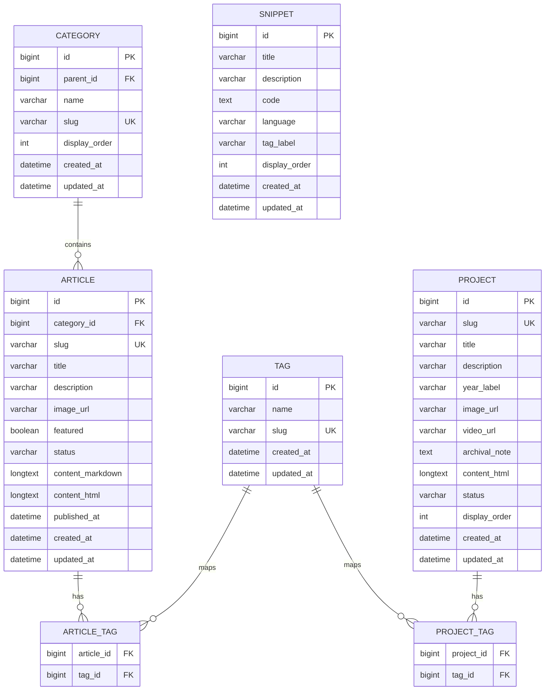

# DB ERD Draft

## 목적

이 문서는 현재 파일 기반으로 렌더링되는 DevArchive 콘텐츠를 DB에서 조회해 Thymeleaf로 렌더링하는 구조로 바꾸기 위한 ERD 초안이다.

현재 구현은 `ArticleService`가 Markdown 파일을 읽고, `ProjectService`가 하드코딩 데이터와 HTML 파일을 읽는다. DB 이관 후에도 Controller와 Thymeleaf 템플릿은 최대한 유지하고, Service 내부의 데이터 출처를 Repository 조회로 교체하는 것을 목표로 한다.

## 설계 범위

1차 이관 범위:

- Article 목록과 상세
- Article 카테고리/서브카테고리
- Article 태그
- Project 목록과 상세
- Project 태그
- Snippet 목록

후순위 범위:

- 로그인/회원
- 관리자 권한
- 이미지 업로드
- 댓글
- 조회수/좋아요
- 검색 인덱스

## ERD 초안



## 테이블별 역할

### `category`

아티클의 카테고리와 서브카테고리를 표현한다.

- 기존 `category`, `subcategory` 문자열을 계층형 테이블로 이관한다.
- `parent_id`가 `null`이면 최상위 카테고리다.
- `parent_id`가 있으면 서브카테고리다.
- `slug`는 URL/필터 파라미터에 사용할 수 있도록 unique로 둔다.

### `article`

블로그 글의 목록/상세 렌더링에 필요한 데이터를 저장한다.

- `slug`는 `/articles/{slug}`에 사용하므로 unique가 필요하다.
- `content_markdown`은 원본 편집본이다.
- `content_html`은 렌더링 캐시로 둘 수 있다.
- 처음에는 `content_markdown`만 저장하고 Service에서 HTML 변환해도 된다.
- `status`는 `DRAFT`, `PUBLISHED`, `ARCHIVED` 정도로 시작한다.

### `tag`

Article과 Project가 함께 사용할 수 있는 공통 태그다.

- 태그를 단순 문자열 배열로 둘 수도 있지만, 검색/필터 확장을 고려하면 별도 테이블이 더 연습에 좋다.
- 처음 구현이 어렵다면 Article CRUD를 먼저 끝낸 뒤 추가한다.

### `article_tag`

Article과 Tag의 다대다 관계를 연결한다.

- 복합 unique key는 `(article_id, tag_id)`로 둔다.
- JPA에서는 `@ManyToMany` 직접 매핑보다 중간 엔티티를 만들어도 된다.
- 학습 목적이면 `ArticleTag` 엔티티를 따로 만들어 관계를 명시적으로 다루는 편이 좋다.

### `project`

프로젝트 목록과 상세 페이지 데이터를 저장한다.

- 기존 `ProjectService`의 하드코딩 데이터를 DB로 옮긴다.
- 상세 본문은 기존 HTML을 `content_html`에 넣고 시작해도 된다.
- 프로젝트도 작성/수정 기능을 붙일 예정이면 Markdown 원본 컬럼을 추가한다.

### `project_tag`

Project와 Tag의 다대다 관계를 연결한다.

### `snippet`

현재 `SiteController` 안의 `snippetsData()` 하드코딩 데이터를 이관할 후보 테이블이다.

- 핵심 블로그 기능보다 후순위다.
- Article CRUD 연습이 끝난 뒤 적용한다.

## 컬럼 설계 결정 포인트

### 본문 저장 방식

선택지:

- Markdown만 DB에 저장하고 요청 시 HTML로 변환
- Markdown과 HTML을 모두 저장
- HTML만 저장

권장 시작점:

```text
content_markdown 저장
content_html은 nullable 캐시 컬럼
```

이유:

- 원본 편집본을 잃지 않는다.
- 현재 Markdown 기반 글을 옮기기 쉽다.
- 나중에 HTML 캐시를 추가하면서 성능과 구조를 비교해볼 수 있다.

### 이미지 저장 방식

초기 권장:

```text
DB에는 image_url 문자열만 저장
실제 파일은 src/main/resources/static 또는 외부 스토리지에 저장
```

이유:

- DB에 바이너리를 바로 넣는 구조보다 단순하다.
- 현재 정적 이미지 경로와 잘 맞는다.
- 나중에 업로드 기능을 붙일 때 파일 저장소 전략만 교체하면 된다.

### 날짜 컬럼

권장:

- `published_at`: 공개 발행일
- `created_at`: DB 생성일
- `updated_at`: 마지막 수정일

JPA에서는 `LocalDateTime`으로 시작하고, 화면 출력 포맷은 View/DTO에서 처리한다.

## 1차 구현 우선순위

1. `article` 단일 테이블로 목록/상세 조회 구현
2. `category` 추가 후 Article과 관계 연결
3. `tag`, `article_tag` 추가
4. `project` 단일 테이블 이관
5. `project_tag` 추가
6. `snippet` 이관

## 아직 결정하지 않은 것

- 사용할 DB: H2, MySQL, PostgreSQL 중 선택 필요
- 마이그레이션 도구: 직접 schema.sql/data.sql, Flyway, Liquibase 중 선택 필요
- 본문 HTML 캐시 여부
- 이미지 업로드 방식
- 관리자 인증 도입 시점

DB와 마이그레이션 도구를 확정하면 `docs/decisions/004-adopt-db-backed-content.md`에 결정 기록을 남긴다.
