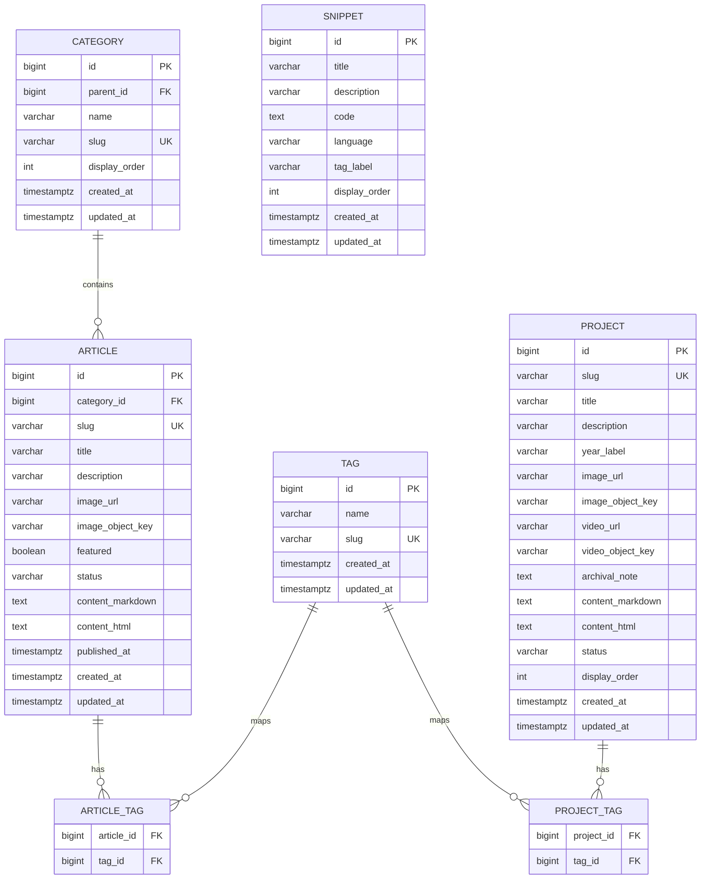

# DB ERD Draft

## 목적

이 문서는 현재 파일 기반으로 렌더링되는 DevArchive 콘텐츠를 DB에서 조회해 Thymeleaf로 렌더링하는 구조로 바꾸기 위한 ERD 초안이다.

현재 구현은 `ArticleService`가 Markdown 파일을 읽고, `ProjectService`가 하드코딩 데이터와 HTML 파일을 읽는다. DB 이관 후에도 Controller와 Thymeleaf 템플릿은 최대한 유지하고, Service 내부의 데이터 출처를 Repository 조회로 교체하는 것을 목표로 한다.

## 설계 범위

1차 이관 범위:

- Article 목록과 상세
- Article 카테고리/서브카테고리
- Article 태그
- Project 목록과 상세
- Project 태그
- Snippet 목록

후순위 범위:

- 로그인/회원
- 관리자 권한
- 이미지 업로드
- 댓글
- 조회수/좋아요
- 검색 인덱스

## ERD 초안



## 확정 기준안

- 메인 DB는 PostgreSQL을 사용한다.
- DB schema 변경 이력은 Flyway migration으로 관리한다.
- 테스트 DB는 초기에는 H2 또는 Testcontainers PostgreSQL 중 구현 난이도에 맞게 선택한다.
- 본문은 `content_markdown` 원본을 필수 저장하고, `content_html`은 nullable 캐시 컬럼으로 둔다.
- 이미지는 DB에 바이너리로 저장하지 않고 URL 또는 object key만 저장한다.
- 로컬 객체 스토리지는 MinIO Docker 컨테이너를 사용하고, 실제 배포에서는 S3 호환 object storage로 교체할 수 있게 둔다.
- 삭제는 물리 삭제보다 `DRAFT`, `PUBLISHED`, `ARCHIVED` 상태값 기반으로 먼저 구현한다.

## 테이블별 역할

### `category`

아티클의 카테고리와 서브카테고리를 표현한다.

- 기존 `category`, `subcategory` 문자열을 계층형 테이블로 이관한다.
- `parent_id`가 `null`이면 최상위 카테고리다.
- `parent_id`가 있으면 서브카테고리다.
- `slug`는 URL/필터 파라미터에 사용할 수 있도록 unique로 둔다.

### `article`

블로그 글의 목록/상세 렌더링에 필요한 데이터를 저장한다.

- `slug`는 `/articles/{slug}`에 사용하므로 unique가 필요하다.
- `content_markdown`은 원본 편집본이다.
- `content_html`은 렌더링 캐시이며, 처음에는 `null`이어도 된다.
- 처음에는 `content_markdown`만 저장하고 Service에서 HTML로 변환한다.
- `status`는 `DRAFT`, `PUBLISHED`, `ARCHIVED` 정도로 시작한다.
- `image_url`은 화면에서 바로 사용할 수 있는 public URL이다.
- `image_object_key`는 MinIO/S3 내부 객체 경로다. 초기 구현에서는 `image_url`만 사용해도 된다.

### `tag`

Article과 Project가 함께 사용할 수 있는 공통 태그다.

- 태그를 단순 문자열 배열로 둘 수도 있지만, 검색/필터 확장을 고려하면 별도 테이블이 더 연습에 좋다.
- 처음 구현이 어렵다면 Article CRUD를 먼저 끝낸 뒤 추가한다.

### `article_tag`

Article과 Tag의 다대다 관계를 연결한다.

- 복합 unique key는 `(article_id, tag_id)`로 둔다.
- JPA에서는 `@ManyToMany` 직접 매핑보다 중간 엔티티를 만들어도 된다.
- 학습 목적이면 `ArticleTag` 엔티티를 따로 만들어 관계를 명시적으로 다루는 편이 좋다.

### `project`

프로젝트 목록과 상세 페이지 데이터를 저장한다.

- 기존 `ProjectService`의 하드코딩 데이터를 DB로 옮긴다.
- 상세 본문은 기존 HTML을 `content_html`에 넣고 시작할 수 있다.
- 프로젝트도 작성/수정 기능을 붙일 예정이면 Markdown 원본 컬럼을 추가한다.
- 프로젝트 이미지와 영상도 DB에는 URL/object key만 저장한다.

### `project_tag`

Project와 Tag의 다대다 관계를 연결한다.

### `snippet`

현재 `SiteController` 안의 `snippetsData()` 하드코딩 데이터를 이관할 후보 테이블이다.

- 핵심 블로그 기능보다 후순위다.
- Article CRUD 연습이 끝난 뒤 적용한다.

## 컬럼 설계 결정 포인트

### 본문 저장 방식

확정 기준:

```text
content_markdown: 필수 원본
content_html: nullable HTML 캐시
```

이유:

- 원본 편집본을 잃지 않는다.
- 현재 Markdown 기반 글을 옮기기 쉽다.
- HTML 렌더러, 코드 하이라이트, 목차 생성, sanitize 정책을 나중에 바꿔도 원본에서 다시 생성할 수 있다.
- 처음에는 요청 시 Markdown을 HTML로 변환하고, 필요할 때 `content_html` 캐시를 채우면 된다.
- HTML만 저장하면 수정 화면에서 원본 편집 경험이 나빠지고 렌더링 정책 변경에 취약하다.

### 이미지 저장 방식

확정 기준:

```text
DB에는 image_url 또는 image_object_key 문자열만 저장
실제 파일은 MinIO/S3 호환 object storage에 저장
```

이유:

- DB가 이미지/영상 바이너리 때문에 무거워지지 않는다.
- 백업, 복구, migration은 메타데이터 중심으로 유지된다.
- 브라우저가 URL로 직접 가져가는 정적 리소스 제공에는 object storage와 CDN이 더 적합하다.
- 로컬 개발은 MinIO로 연습하고, 배포 시 AWS S3, Cloudflare R2, Naver Object Storage 같은 S3 호환 저장소로 교체하기 쉽다.
- 애플리케이션은 업로드 후 반환된 object key 또는 public URL만 Article/Project에 저장하면 된다.

로컬 MinIO 예시:

```yaml
services:
  minio:
    image: minio/minio:latest
    command: server /data --console-address ":9001"
    ports:
      - "9000:9000"
      - "9001:9001"
    environment:
      MINIO_ROOT_USER: devarchive
      MINIO_ROOT_PASSWORD: devarchive-password
    volumes:
      - minio-data:/data

volumes:
  minio-data:
```

### 날짜 컬럼

권장:

- `published_at`: 공개 발행일
- `created_at`: DB 생성일
- `updated_at`: 마지막 수정일

JPA에서는 `LocalDateTime`으로 시작하고, 화면 출력 포맷은 View/DTO에서 처리한다.

## 1차 구현 우선순위

1. `article` 단일 테이블로 목록/상세 조회 구현
2. `category` 추가 후 Article과 관계 연결
3. `tag`, `article_tag` 추가
4. `project` 단일 테이블 이관
5. `project_tag` 추가
6. `snippet` 이관

## 아직 결정하지 않은 것

- 테스트 전략: H2로 시작할지 Testcontainers PostgreSQL까지 갈지 선택 필요
- `content_html` 캐시를 언제 채울지 선택 필요
- 이미지 URL을 public bucket URL로 둘지, 애플리케이션이 presigned URL을 발급할지 선택 필요
- 관리자 인증 도입 시점

확정된 DB/스토리지 기준은 [DB 기반 콘텐츠 전환 결정 기록](../decisions/004-adopt-db-backed-content.md)에 남긴다.
