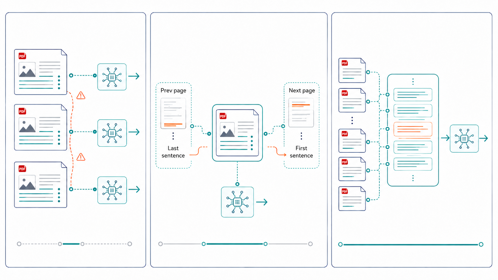
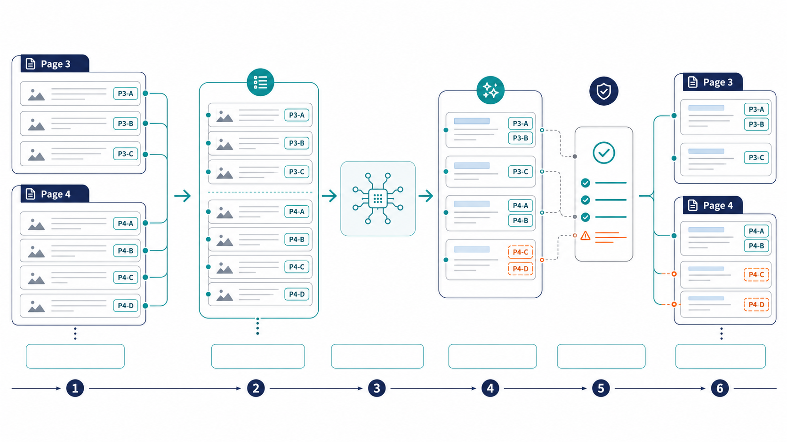
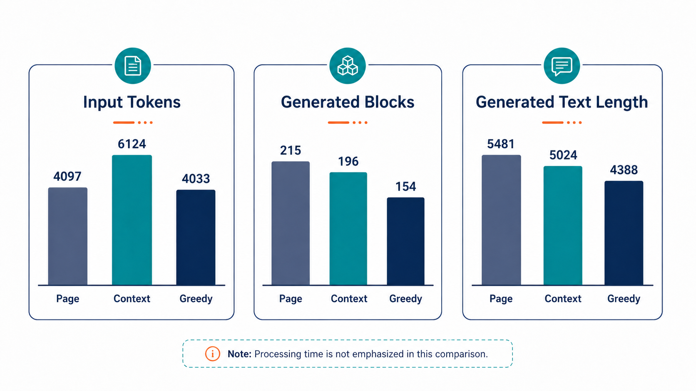

난독증 아동을 위한 교안 생성 프로젝트에서 AI를 활용해 PDF 원서를 난독증 친화 교안으로 변환하는 파이프라인 구현을 담당했다. 처음에는 가장 직관적이고 단순한 페이지 기준 처리 방식을 선택했다.

PDF가 이미 페이지로 나뉘어 있으니 각 페이지의 텍스트를 AI에 전달하고, 생성된 결과를 페이지 번호와 함께 저장한 뒤 순서대로 조립하면 된다고 생각했다.

> PDF 텍스트 추출 → 페이지별 AI 변환 → 페이지별 저장 → 전체 문서 조립

페이지 단위 처리는 시스템을 운영하기에 편리했다.

- 여러 페이지를 병렬로 처리할 수 있다.
- 실패한 페이지만 다시 요청할 수 있다.
- 결과가 어느 페이지에서 생성됐는지 명확하다.
- 페이지 번호를 기준으로 결과를 쉽게 조립할 수 있다.

하지만 앞뒤 문맥이 없어 좋은 품질의 결과를 얻기는 어려웠다.

---

## 문제 인식: 문서는 페이지 끝에서 멈추지 않는다

페이지는 인쇄와 화면 구성을 위한 경계일 뿐, 문장이나 이야기의 경계는 아니다. 문장은 다음 페이지까지 이어지기도 하고, 앞 페이지에서 등장한 대상을 다음 페이지에서 “그것”이나 “그 아이”라고 부르기도 한다.

사람은 앞 페이지의 내용을 기억하기 때문에 자연스럽게 이해할 수 있지만, AI는 전달받은 현재 페이지만 볼 수 있어 자연스러운 변환을 수행하기 어렵다. 이로 인해 다음과 같은 문제가 발생했다.

- 대명사가 가리키는 대상이 모호해진다.
- 페이지 사이에서 문장이 어색하게 연결된다.
- 앞선 사건과 이후 결과의 인과관계가 약해진다.
- 같은 등장인물이나 용어가 페이지마다 다르게 표현된다.
- 페이지가 바뀌면서 서술 문체가 달라진다.

페이지 단위 처리 방식은 결과를 조립하고 저장하기에는 좋았지만, AI 교안 생성 품질 면에서는 적합하지 않았다. 그래서 다음 질문을 기준으로 처리 방식을 개선하기 시작했다.

> 페이지 단위 처리의 안정성은 유지하면서 AI에는 더 넓은 문맥을 제공할 수 없을까?

---

## 해결 과정: 세 가지 청킹 방식 비교

같은 PDF를 세 가지 방식으로 변환해 결과를 비교했다.



### 1. 페이지 단위 처리

첫 번째 방식은 기존과 동일하게 현재 페이지의 내용만 AI에 전달하는 방식이다.

결과 조립과 실패 복구가 쉽고 여러 페이지를 병렬로 처리할 수 있다는 장점이 있다. 반면 페이지 경계를 넘어가는 문맥은 AI가 알 수 없다.

### 2. 앞뒤 문단을 참고 문맥으로 제공

두 번째 방식에서는 현재 페이지를 변환할 때 다음 문단들을 함께 전달했다.

- 이전 페이지의 마지막 문단 2개
- 변환 대상인 현재 페이지
- 다음 페이지의 첫 문단 2개

프롬프트에서는 입력을 두 영역으로 구분했다.

- **참고 문맥:** 앞뒤 페이지에서 가져온 문단
- **변환 대상:** 실제 결과에 포함할 현재 페이지

AI에는 참고 문맥을 내용 이해에만 사용하고, 결과에는 현재 페이지의 내용만 출력하도록 지시했다.

이 방식은 기존의 페이지 단위 저장과 실패 복구 구조를 유지하면서도 페이지 경계의 문맥을 상당 부분 보완할 수 있었다. 다만 동일한 참고 문맥을 여러 요청에 반복해서 포함하기 때문에 입력 토큰이 증가했다. 앞뒤 문단 몇 개만으로는 문서 전체의 문체까지 유지하기 어렵다는 한계도 있었다.

### 3. 페이지 경계를 넘는 그리디 청킹

세 번째 방식에서는 페이지 경계를 입력 기준에서 제거했다.

PDF에서 추출한 문단을 원문 순서대로 추가하면서, 그리디 알고리즘을 사용해 설정한 토큰 한도에 도달할 때까지 하나의 청크에 최대한 많이 포함했다. 페이지가 달라도 토큰 여유가 있으면 같은 요청에 넣었다.

이 방식에서는 AI가 더 넓은 흐름을 한 번에 읽을 수 있었다.

- 페이지 경계의 문맥을 자연스럽게 연결할 수 있다.
- 문단 중간을 억지로 자르지 않는다.
- 문서 전체의 문체를 유지하기 쉽다.
- 긴 문서에서는 요청 횟수를 줄일 수 있다.

하지만 하나의 요청에 여러 페이지가 포함되면서 새로운 문제가 발생했다. 생성된 결과를 다시 원본 페이지에 배치해야 했다.

이를 해결하기 위해 각 원문 문단에 고유한 `sourceUnitId`를 부여했다.

```text
page-3-paragraph-1
page-3-paragraph-2
page-4-paragraph-1
```



AI가 생성한 각 블록에는 참고한 원문 문단의 `sourceUnitIds`를 반환하도록 했다. 실제 페이지 번호와 최종 블록 ID는 AI가 아니라 코드에서 결정했다.

변환 후에는 다음 항목을 검사했다.

- 출처 ID가 누락되지 않았는가?
- 입력에 존재하지 않는 ID를 반환하지 않았는가?
- 결과에 반영되지 않은 원문 문단은 없는가?
- 생성 결과를 원본 페이지에 다시 배치할 수 있는가?

이를 통해 하나의 청크가 여러 페이지에 걸쳐 있더라도 결과를 다시 페이지별로 조립할 수 있었다.

---

## 실험 및 결과

실험에는 『Alice in Wonderland』 일부가 담긴 6페이지짜리 PDF를 사용했다. 샘플에는 문장이 페이지 사이에서 잘린 부분과, 앞 페이지의 대상을 대명사로 다시 지칭하는 부분이 포함되어 있었다.

### 실험 조건

- 텍스트 모델: GPT-5.6
- 세 방식 모두 동일한 시스템 프롬프트 사용
- 동일한 구조화 출력 형식 사용
- 이미지 생성을 제외하고 텍스트 결과만 비교
- 같은 PDF를 각 방식으로 1회 실행

전체 결과는 다음과 같았다.



| 방식 | 요청 수 | 입력 토큰 | 생성 블록 | 생성 텍스트 | 처리 시간 |
| --- | ---: | ---: | ---: | ---: | ---: |
| 페이지 단위 | 6 | 4,097 | 215 | 5,481자 | 126.5초 |
| 앞뒤 문단 | 6 | **6,124** | 196 | 5,024자 | 117.8초 |
| 그리디 청킹 | **1** | 4,033 | **154** | **4,388자** | **109.3초** |

각 방식을 한 번씩 실행한 결과이므로 처리 시간만으로 성능 우위를 판단할 수는 없다. 다만 앞뒤 문단 방식은 같은 문맥을 반복해서 전달하면서 입력 토큰이 가장 많았다. 그리디 청킹은 요청 횟수가 줄었지만, 생성된 블록과 전체 텍스트 길이도 가장 짧았다.

---

### 사례 1. “그것”이 “후추”가 되었다

**이전 페이지 영어 원문**

> ‘There’s certainly too much pepper in that soup!’ Alice said to herself, as well as she could for sneezing.

**다음 페이지 영어 원문**

> There was certainly too much of it in the air.

**생성 결과**

| 방식 | 결과 |
| --- | --- |
| 페이지 단위 | “공기에는 분명 그것이 너무 많이 떠다녔다.” |
| 앞뒤 문단 | “공기에도 후추가 너무 많이 퍼져 있었다.” |
| 그리디 청킹 | “공기 중에도 후추가 틀림없이 너무 많았다.” |

페이지 단위 결과도 문법적으로 틀리지는 않았지만, 현재 페이지만 보면 “그것”이 무엇을 의미하는지 알기 어려웠다.

앞뒤 문단 방식과 그리디 청킹은 이전 페이지를 함께 읽었기 때문에 대상을 “후추”로 구체화했다. 문맥을 추가한 효과가 가장 분명하게 나타난 사례였다.

---

### 사례 2. 페이지 사이에서 문장이 잘린 경우

**이전 페이지 영어 원문**

> The Duchess took no notice of them even when they hit her; and the baby

**다음 페이지 영어 원문**

> was howling so much already, that it was quite impossible to say whether the blows hurt it or not.

**생성 결과**

| 방식 | 결과 |
| --- | --- |
| 페이지 단위 | “아기는 이미 아주 크게 울부짖고 있었다. 그래서 맞아서 아픈지 아닌지 도무지 알 수 없었다.” |
| 앞뒤 문단 | “아기는 이미 아주 크게 울부짖고 있었다. 그래서 아기가 맞아서 아픈지는 전혀 알 수 없었다.” |
| 그리디 청킹 | “아기는 이미 너무 크게 울부짖고 있었다. 그래서 물건에 맞아 아픈지는 전혀 알 수 없었다.” |

세 방식 모두 페이지 사이에서 잘린 주어인 “아기”를 복원했다. 다음 페이지 안에도 아기를 추론할 수 있는 단서가 있었기 때문에 페이지 단위 처리도 자연스러운 문장을 만들 수 있었다.

차이는 두 번째 문장에서 나타났다. 페이지 단위 결과는 무엇에 맞았는지가 생략됐고, 앞뒤 문단 방식은 아프다는 대상이 아기임을 분명히 했다. 그리디 청킹은 이전 페이지에서 냄비와 접시가 날아왔다는 내용까지 연결해 “물건에 맞아”라고 표현했다.

문맥을 넓힌다고 모든 문장이 크게 달라지는 것은 아니지만, 앞선 사건과 결과의 관계를 구체화하는 데는 도움이 됐다.

---

### 사례 3. 눈물이 누구의 눈물인지

**이전 페이지 영어 원문**

> ‘But perhaps it was only sobbing,’ she thought, and looked into its eyes again, to see if there were any tears.

**다음 페이지 영어 원문**

> No, there were no tears.

**생성 결과**

| 방식 | 결과 |
| --- | --- |
| 페이지 단위 | “아니, 눈물은 없었다.” |
| 앞뒤 문단 | “아니, 아기의 눈에는 눈물이 없었다.” |
| 그리디 청킹 | “하지만 아기의 눈에는 눈물이 없었다.” |

페이지 단위 결과에서는 눈물의 대상이 생략됐다. 앞 문장을 기억하고 있다면 이해할 수 있지만, 현재 페이지만 읽으면 누구의 눈물인지 바로 알기 어렵다.

앞뒤 문단 방식은 “아기의 눈”이라고 대상을 복원했다. 그리디 청킹도 같은 대상을 복원하면서 “하지만”이라는 접속 표현을 사용해 이전 문장과의 연결을 더 분명하게 만들었다.

---

### 문맥 외에 추가로 확인한 차이

세 사례를 비교하면서 페이지 경계 외의 차이도 확인할 수 있었다.

페이지 단위와 앞뒤 문단 결과에서는 5페이지의 서술 문체만 갑자기 “했습니다”로 바뀌었다. 반면 그리디 청킹은 전체 문서를 같은 요청에서 처리하면서 “했다” 문체를 일관되게 유지했다.

그리디 청킹의 생성 블록과 전체 텍스트가 가장 짧았다는 점도 눈에 띄었다. 실제 결과를 살펴보니 원문의 직접 대화를 간접 표현으로 바꾸는 등 핵심 의미를 유지하면서 세부 표현을 더 많이 압축하는 경향이 있었다.

첫 번째 그리디 요청에서는 6페이지 전체의 출력 JSON이 중간에 잘리기도 했다. 입력 토큰은 한도 안에 있었지만, 읽기 쉬운 한국어 블록으로 변환하는 과정에서 출력이 예상보다 길어진 것이 원인이었다. 출력 한도를 늘린 뒤에는 성공했지만, 큰 청크를 사용할 때는 입력 크기뿐 아니라 예상 출력 길이와 실패 범위도 함께 고려해야 했다.

---

## 결론

실험을 시작하기 전에는 가능한 한 많은 문단을 하나의 청크에 담으면 문맥 문제가 가장 잘 해결될 것이라고 생각했다.

실제 결과에서도 그리디 청킹은 대명사의 대상을 복원하고, 앞선 사건과 결과를 연결하고, 문서 전체의 문체를 유지하는 데 가장 좋은 모습을 보였다. 처음 예상했던 것처럼 넓은 문맥은 분명 도움이 됐다.

하지만 문맥을 많이 제공하는 것이 항상 더 좋은 결과만 만드는 것은 아니었다. 그리디 청킹은 원문을 더 적극적으로 압축했고, 첫 실행에서는 긴 JSON 응답이 중간에 잘렸다. 요청 하나가 실패했을 때 다시 처리해야 하는 범위도 페이지 단위 방식보다 컸다.

반대로 페이지 단위 처리는 문맥 면에서는 가장 약했지만 결과를 저장하고 조립하거나 실패한 부분만 다시 처리하기에는 여전히 가장 안정적이었다. 앞뒤 문단 방식은 기존 구조를 거의 바꾸지 않고도 페이지 경계의 문맥을 보완할 수 있었지만, 문서 전체의 문체까지 유지하기에는 범위가 부족했고 입력 토큰이 가장 많이 들었다.

결국 세 방식 중 하나를 완전히 버리고 하나만 선택하는 문제는 아니었다. 각각 잘하는 역할이 달랐다.

- 페이지는 결과를 저장하고 화면에 조립하는 단위로 적합했다.
- 문단은 원문을 나누고 `sourceUnitId`로 추적하기에 적합했다.
- 그리디 청크는 AI에 넓은 문맥을 전달하는 데 적합했다.
- 앞뒤 문단은 토큰 한도 때문에 청크가 나뉘는 경계를 보완하기에 적합했다.

그래서 다음 단계에서는 문단 순서를 유지한 그리디 청킹을 기본 문맥으로 사용하고, 청크가 나뉘는 지점에는 앞뒤 문단을 참고 문맥으로 붙이는 슬라이딩 윈도 방식으로 고도화하려 한다.

처음에는 페이지 경계에서 끊긴 문맥 하나만 해결하면 된다고 생각했지만, 실험을 진행하면서 청킹은 문맥뿐 아니라 출처 추적, 출력 길이, 실패 복구와 결과 조립까지 함께 고려해야 하는 문제라는 것을 알게 됐다.

AI에는 이해에 필요한 만큼의 문맥을 제공하고, 애플리케이션은 그 결과를 추적하고 검증하고 복구할 수 있어야 한다.
