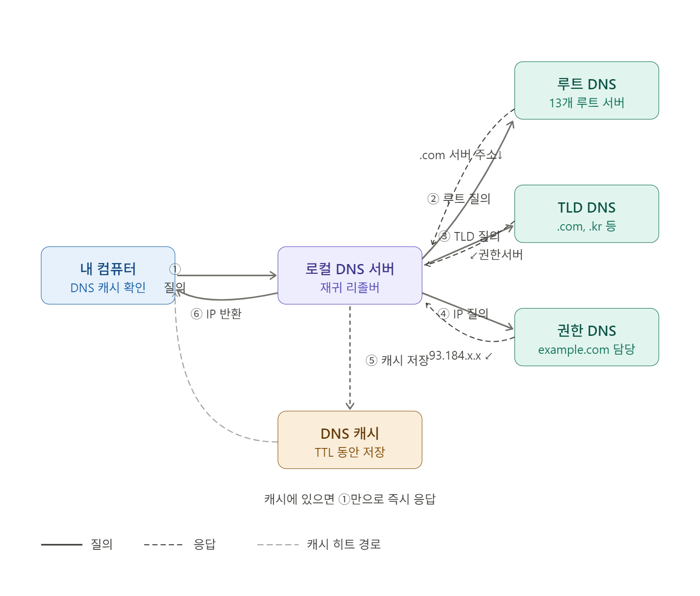

# Wireshark Lab: DNS

Status: 시작 전

## 0. 사전 지식

### **0.1 로컬 DNS 서버**의 작동 방식

**로컬 DNS 서버(Recursive Query)**는 호스트 이름을 IP 주소로 변환하며 인터넷 인프라에서 핵심적인 역할을 수행합니다. 로컬 DNS 서버는 도메인 조회 시 다음과 같이 작동합니다.

1. **캐시 확인:** 내 컴퓨터의 로컬 캐시에 이미 IP가 있으면 즉시 사용. 없으면 로컬 DNS 서버로 질의
2. **루트 DNS 질의:** 로컬 DNS가 루트 서버에 요청 → "`.com` 담당 서버 주소는 여기야" 응답
3. **TLD DNS 질의:** `.com` 담당 서버에 요청 → "`example.com` 권한 서버 주소는 여기야" 응답

   > **TLD**는 **최상위 도메인(Top-Level Domain)**의 약자로, 도메인 이름의 가장 마지막 부분에 위치한 요소를 의미한다.
   >
   > TLD는 목적이나 지역에 따라 크게 세 가지로 분류할 수 있다.
   >
   > 1. **gTLD (일반 최상위 도메인, generic TLD):** 일반적으로 사용되는 도메인
   >    - `.com` (상업용), `.net` (네트워크), `.org` (비영리단체), `.edu` (교육기관)
   > 2. **ccTLD (국가 코드 최상위 도메인, country code TLD):** 특정 국가나 지역을 나타내는 도메인
   >    - `.kr` (한국), `.jp` (일본), `.us` (미국), `.uk` (영국)
   > 3. **New gTLD (신규 일반 최상위 도메인):** 최근에 추가된 다양한 목적의 도메인
   >    - `.app`, `.blog`, `.tech`, `.ai`, `.guru` 등

4. **권한 DNS 질의:** 최종적으로 `example.com`을 직접 관리하는 서버에 요청 → 실제 IP 주소 반환
5. **캐시 저장:** 로컬 DNS 서버가 결과를 TTL 시간 동안 캐싱
6. **IP 반환:** 로컬 컴퓨터에 최종 IP 전달 → 서버 접속



---

### **0.2 DNS 캐싱**


**캐시 계층 구조**는 브라우저 → OS → 로컬 DNS 서버 순으로 확인하며, 위 계층에서 히트될수록 응답이 빠릅니다.

**TTL과 캐시 만료** 흐름은 이렇습니다. 권한 DNS 서버가 레코드에 TTL을 설정하면, 각 계층이 그 값을 기준으로 캐시를 유지합니다. 실제로는 브라우저가 가장 먼저 만료(보통 TTL의 40~60% 수준으로 자체 제한), OS가 그 다음, 로컬 DNS 서버가 마지막으로 만료됩니다. 모든 캐시가 만료되면 비로소 권한 DNS 서버까지 전체 질의가 다시 발생합니다.

**TTL 설정 전략**으로는 짧은 TTL(60~300초)은 IP 변경이 빠르게 전파되어야 할 때(예: 서버 이전, 장애 대응) 유용하고, 긴 TTL(3600초 이상)은 조회 부하를 줄이고 응답 속도를 높입니다. 서버 이전 계획이 있다면 미리 TTL을 단축해두는 것이 일반적인 실무 패턴입니다.

---

### **0.3 DNS 레코드 및 메시지** 구조

**DNS 메시지 구조**는 질의·응답 모두 동일한 5섹션 포맷을 공유합니다.

- 헤더(12바이트)에는 `ID`(질의-응답 매칭용), `QR`(질의/응답 구분), `RCODE`(오류 코드), 그리고 각 섹션의 레코드 개수(QDCOUNT, ANCOUNT 등)가 들어 있습니다.
- 질문 섹션에는 조회할 도메인명(`QNAME`)과 레코드 타입(`QTYPE`)이 담깁니다.
- 응답 섹션의 각 리소스 레코드(RR)는 `NAME · TYPE · CLASS · TTL · RDATA` 구조이며, TTL이 바로 여기에 포함되어 캐시 유효기간을 결정합니다.
- 권한/추가 섹션은 주로 캐시 미스 상황에서 다음 단계 서버 정보를 전달하는 데 쓰입니다.


---

### 0.4 DNS 레코드의 **TYPE 필드**

**DNS 레코드 유형**은 도메인에 어떤 정보를 연결할지 정의합니다.


<aside>
💡

**Canonical 호스트 이름 (Canonical Hostname)**

**호스트 이름**은 숫자로 된 IP 주소를 사람이 기억하기 쉽게 문자로 바꾼 이름(예: `google.com`)입니다. 그중에서도 **Canonical(정준/기본)** 호스트 이름은 여러 이름 중 **'진짜 공식 이름'**을 의미합니다.

- **별칭(Alias)과 정준 이름:** 하나의 서버는 여러 이름을 가질 수 있습니다.
  - 예를 들어, `www.test.com`이라는 이름이 실제로는 `server-01.main-provider.com`이라는 서버를 가리키고 있다면:
    - `www.test.com`은 **별칭(Alias)**입니다.
    - `server-01.main-provider.com`은 **Canonical Name(CNAME)**, 즉 진짜 공식 이름입니다.
- **DNS에서의 역할:** DNS 설정에서 CNAME 레코드를 사용하면, 별칭을 공식 이름으로 연결해 주는 역할을 합니다.
</aside>

---

## 1. nslookup

### 1.1 nslookup 직접 실행해보기


nslookup 실행 결과

터미널을 열고 `nsloopup` 명령어를 입력하면, 현재 내 컴퓨터가 어떤 DNS 서버를 사용하고 있는지 알 수 있습니다. 제 결과에는 `kns.kornet.net`과 `168.126.63.1`이라는 주소가 나왔습니다. 이 정보가 의미하는 바는 다음과 같습니다.

- **Default Server (kns.kornet.net):** 현재 제 컴퓨터가 도메인 주소를 물어볼 때 가장 먼저 응답해 주는 로컬 네임 서버(Local Name Server)의 이름입니다. `kns.kornet.net` 이름에서 알 수 있듯이, 이는 제가 사용하는 인터넷 회선인 KT의 DNS 서버임을 알 수 있습니다.
- **Address (168.126.63.1):** DNS 서버의 실제 IP 주소입니다.

nslookup 명령어에 호스트 네임을 인자로 주면 특정 호스트의 IP 주소를 찾아볼 수 있습니다. 이 명령의 응답은 크게 두 부분으로 나누어 정보를 제공합니다.


- **DNS 서버 정보:** 정보를 제공한 DNS 서버의 이름과 IP 주소
  > **Server:** `kns.kornet.net`
  >
  > **Address:** `168.126.63.1`
  >
  > 제 컴퓨터가 네이버의 주소를 물어보기 위해 방문한 **로컬 네임 서버**입니다. 제가 사용 중인 KT의 DNS 서버가 네이버 주소 요청을 처리해 주었음을 알 수 있습니다.
- **요청의 응답:** www.naver.com의 정식(canonical) 호스트 이름과 IP 주소
  > **Aliases (별칭):** `www.naver.com`
  >
  > **CNAME (Canonical Name):** `www.naver.com.nheos.com`
  >
  > **Addresses (IP 주소들):** \* `223.130.192.247` , `223.130.200.219` , `223.130.192.248` , `223.130.200.236`
  >
  > 응답받은 결과의 중간에 나오는 **Non-authoritative answer**는 KT의 DNS의 캐싱된 데이터를 읽어왔음을 의미합니다. 반대로 **Authoritative**는 KT의 DNS가 네이버가 운영하는 **권한 있는 네임 서버(Authoritative Name Server)**에 직접 가서 물어본 결과를 의미합니다.
  >
  > 우리는 `www.naver.com` 주소로 접속하지만, 내부적으로는 DNS는 `www.naver.com.nheos.com`이라는 **Canonical Name**으로 먼저 연결됩니다. 이는 네이버가 **GSLB(전역 부하 분산)** 등을 통해 사용자와 가장 가까운 서버로 트래픽을 효율적으로 유도하기 위해 사용하는 기술적 장치입니다.
  >
  > 또한 많은 사용자가 동시에 접속할 때 서버의 요청을 분산하기 위해 여러 대의 서버(IP주소)를 운영하고 있음을 확인할 수 있었습니다.

### 1.2 DNS 레코드 유형과 NS 쿼리


특정 호스트 조회: www.naver.com


도메인 네임 조회: naver.com

nslookup 명령어에 **“Type=NS”** 옵션을 사용하면 **책임(authoritative) DNS 서버의 호스트 이름 및 IP 주소**를 확인할 수 있습니다.

그런데, 네이버의 DNS 서버와 IP주소를 확인하기 위해 [`www.naver.com`](http://www.naver.com)을 조회했지만 **CNAME**과 주 네임 서버의 이름 및 부가적인 정보만을 받았습니다. 이는 **SOA(Start of Authority)** 레코드라고 부르며 네임 서버 정보를 찾는 과정에서 해당 영역의 권한 설정 정보를 반환한 것입니다.

이렇게 NS 레코드 대신 SOA 레코드를 반환한 이유는 `www.[naver.com](http://naver.com)` 이라는 특정 호스트에 NS 레코드가 직접 설정되어 있지 않기 때문입니다. 일반적으로 NS 레코드는 도메인의 뿌리가 되는 **Zone Apex**에 설정됩니다. **Zone Apex**란 `www`, `mail`, `ftp` 같은 서브 도메인이 붙지 않은 도메인 이름 그 자체를 의미합니다. 따라서 책임 DNS 서버의 호스트 이름 및 IP 주소를 얻기 위해서는 도메인 이름 그 자체인 `naver.com`에 쿼리를 요청해야 합니다.

### 1.3 추가 기능 및 역방향 조회

`nslookup`에는 `-type=NS` 외에도 다양한 옵션이 있습니다. 다음은 자주 사용되는 10가지 `nslookup` 명령어 예시 사이트와 매뉴얼 페이지입니다.

- [10가지 인기 nslookup 사용법](https://www.cloudns.net/blog/10-most-used-nslookup-commands/)
- [nslookup 매뉴얼 페이지(man pages)](https://linux.die.net/man/1/nslookup)

`nslookup` 은 IP의 주소로 호스트 이름을 찾는 **역방향 DNS 조회(reverse DNS lookup)**에도 사용될 수 있습니다. 다음과 같이 IP 주소(`103.6.174.86`)를 인자로 지정하면, `nslookup`은 해당 주소를 가진 호스트 이름(`gnsl.nheos.com`)을 반환합니다.


---

## 2. 내 컴퓨터의 DNS 캐시


DNS 캐시 확인


DNS 캐시 초기화

네트워크 통신에서 도메인 이름을 IP 주소로 변환하는 DNS 과정은 필수적입니다. 하지만 매번 변환 요청이 DNS 서버로 향한다면, 네트워크 트래픽이 굉장히 혼잡해질 것입니다. 이러한 문제점을 해결하기 위해 **DNS Resolver Cache**를 사용합니다. 이 기술은 최근에 검색한 DNS 레코드를 운영체제가 메모리에 보관하는 기술입니다. 애플리케이션이 호스트 이름 변환을 요청할 때 DNS 서버로 바로 요청하지 않고 로컬 DNS 서버의 캐시된 레코드 값을 찾아봅니다.

이렇게 저장된 캐시 레코드는 일정 시간이 지나 만료되면 메모리에서 삭제됩니다. 또는 사용자가 명시적으로 DNS 캐시에 있는 레코드를 삭제할 수 있습니다.

```powershell
ipconfig /displaydns # DNS 캐시 확인
ipconfig /flushdns # DNS 캐시 초기화
```

---

## 3. Wireshark를 이용한 DNS 추적

이제 Wireshark를 이용해서 DNS 분석을 시작해 보겠습니다. 교재 Wireshark Lab: DNS v9.0의 실습 내용을 따라 진행해 보겠습니다.

> - 호스트의 **DNS 캐시를 비우세요.**
> - 웹 브라우저를 열고 **브라우저 캐시를 비우세요.**
> - Wireshark를 실행하고 디스플레이 필터에 `ip.addr == <본인 컴퓨터의 IP 주소>`를 입력하세요.
> - Wireshark에서 **패킷 캡처를 시작**하세요.
> - 브라우저로 다음 웹 페이지에 접속하세요: [http://gaia.cs.umass.edu/kurose_ross/](http://gaia.cs.umass.edu/kurose_ross/)
> - 패킷 캡처를 **중단**하세요.

---

### 트레이스 분석


**5.** `gaia.cs.umass.edu` 이름을 해석하는 **첫 번째 DNS 쿼리 메시지**를 찾으세요. 해당 DNS 쿼리 메시지의 패킷 번호는 무엇인가요? 이 쿼리 메시지는 UDP와 TCP 중 무엇을 통해 전송되었나요?

> - 패킷 번호: 170
> - 전송 프로토콜: UDP
> - 가장 첫 번째로 받은 DNS 쿼리 메시지는 A레코드를 요청하는 쿼리가 아닌 HTTPS에 대한 쿼리였습니다. A 레코드를 요청하는 쿼리는 두 번째로 요청한 171번 패킷입니다.

**6.** 초기 DNS 쿼리에 대한 **해당 DNS 응답**을 찾으세요. 해당 DNS 응답 메시지의 패킷 번호는 무엇인가요? 이 응답 메시지는 UDP와 TCP 중 무엇을 통해 수신되었나요?

> - 패킷 번호: 251
> - 전송 프로토콜: UDP
> - 첫 번째 DNS 쿼리에 대한 응답은 251번 패킷이었습니다.

**7.** DNS **쿼리 메시지**의 목적지 포트(Destination Port)는 무엇인가요? DNS **응답 메시지**의 출발지 포트(Source Port)는 무엇인가요?

> - 요청 패킷의 Destination Port: 53
> - 응답 패킷의 Source Port: 53

**8.** DNS 쿼리 메시지는 **어떤 IP 주소**로 전송되었나요?

> - DNS 쿼리가 전송된 IP 주소: 168.126.63.2

**9.** DNS 쿼리 메시지를 조사하세요. 이 DNS 메시지에는 몇 개의 **"질문(questions)"**이 포함되어 있나요? **"답변(answers)"**은 몇 개 포함되어 있나요?


> - Question: 1개
> - Answer RRs: 1개

**10.** 초기 쿼리 메시지에 대한 DNS 응답 메시지를 조사하세요. 이 DNS 메시지에는 몇 개의 **"질문"**과 **"답변"**이 포함되어 있나요?


> - Qestion: 1개
> - Answer RRs: 0개

**11.** 기본 페이지(`http://gaia.cs.umass.edu/kurose_ross/`)는 이미지 객체(`http://gaia.cs.umass.edu/kurose_ross/header_graphic_book_8E_2.jpg`)를 참조하며, 이 이미지 역시 `gaia.cs.umass.edu` 서버에 있습니다.


1. 기본 페이지에 대한 초기 **HTTP GET 요청**의 패킷 번호는 무엇인가요?

   > 246번 패킷 (`28.119.245.12`(gaia 서버)로 보낸 첫 번째 `GET /kurose_ross/` 메시지)

2. 이 초기 HTTP 요청을 보내기 위해 `gaia.cs.umass.edu`를 해석하는 **DNS 쿼리**의 패킷 번호는 무엇인가요?

   > 171번 패킷 (IP 주소를 얻기 위해 요청한 A 레코드 쿼리)

3. 수신된 **DNS 응답**의 패킷 번호는 무엇인가요?

   > 249번 패킷 (171번 쿼리에 대한 직접적인 응답 패킷)

4. 이미지 객체에 대한 **HTTP GET 요청**의 패킷 번호는 무엇인가요?

   > 259번 패킷에서 서버가 HTTPS로 리다이렉트(301)를 지시했기 때문에, 이후의 이미지 요청은 암호화된 TLS 통신 내에서 이루어집니다. 따라서 와이어샤크의 HTTP 필터로는 직접적인 GET 요청 패킷 번호를 확인할 수 없었습니다.

5. 이 두 번째 HTTP 요청을 보내기 위해 수행된 **DNS 쿼리**의 패킷 번호는 무엇인가요?

   > **DNS 캐싱** 원리에 따라 동일 도메인에 대한 IP 주소는 이미 확보된 상태이므로 **이미지 요청을 위한 추가적인 DNS 질의는 발생하지 않습니다.**

6. **DNS 캐싱**이 이 마지막 질문(이미지 요청 시의 DNS 쿼리)의 결과에 어떤 영향을 미치는지 설명하세요.

   > 브라우저는 첫 번째 DNS 질의(171번)를 통해 얻은 `gaia.cs.umass.edu`의 IP 주소를 로컬 **DNS 캐시**에 저장합니다. 따라서 이미지 파일을 가져올 때는 서버에 다시 물어볼 필요 없이 캐시에 저장된 IP 주소를 즉시 재사용합니다. 이 덕분에 불필요한 네트워크 지연(RTT) 없이 빠르게 이미지를 요청할 수 있게 됩니다.

---

### nslookup 실행 및 분석

다음으로 `nslookup`을 사용하여 분석해 보겠습니다.

> - 패킷 캡처를 시작하세요.
> - `www.cs.umass.edu`에 대해 `nslookup`을 실행하세요.
> - 패킷 캡처를 중단하세요.
> - Wireshark 창에 결과가 나타날 것입니다. 첫 번째 **Type A 쿼리**를 살펴보겠습니다.


요청


응답

**12.** DNS 쿼리 메시지의 **목적지 포트**는 무엇인가요? DNS 응답 메시지의 **출발지 포트**는 무엇인가요?

> - 요청 패킷의 Destination Port: 53
> - 응답 패킷의 Source Port: 53
> - DNS는 표준적으로 UDP 53번 포트를 사용합니다. 77번 요청의 목적지와 78번 응답의 출발지 포트가 모두 53번임을 확인할 수 있습니다.

**13.** DNS 쿼리 메시지는 **어떤 IP 주소**로 전송되었나요? 이것이 여러분의 **기본 로컬 DNS 서버**의 IP 주소인가요?

> - 168.126.63.1로 전송되었습니다. 이 주소는 한국에서 널리 쓰이는 **KT의 기본 DNS 서버 주소**로, 현재 네트워크 환경에서 설정된 로컬 DNS 서버(Recursive Resolver) 역할을 하고 있습니다

**14.** DNS 쿼리 메시지를 조사하세요. 어떤 **"유형(Type)"**의 DNS 쿼리인가요? 쿼리 메시지에 "답변"이 포함되어 있나요?

> - A (IPv4 주소), AAAA (IPv6 주소), HTTPS 타입 등이 있습니다.
> - 쿼리는 질문을 던지는 단계이므로 `Answer RRs: 0`이며 답변 정보를 포함하지 않습니다.

**15.** 쿼리 메시지에 대한 DNS 응답 메시지를 조사하세요. 이 DNS 응답 메시지에는 몇 개의 **"질문"**과 **"답변"**이 포함되어 있나요?

> - 질문, 답변 모두 1개가 존재합니다.

---

### Type NS 쿼리 분석

마지막으로, `nslookup`을 사용하여 **Type NS** DNS 레코드를 반환하는 명령을 실행해 보겠습니다.

> `nslookup –type=NS umass.edu`


**16.** DNS 쿼리 메시지는 **어떤 IP 주소**로 전송되었나요? 이것이 여러분의 기본 로컬 DNS 서버의 IP 주소인가요?

> - **전송된 IP 주소:** **168.126.63.1**
> - 기본 로컬 DNS 서버(KT DNS)로 전송되었습니다

**17.** DNS 쿼리 메시지를 조사하세요. 쿼리에 몇 개의 질문이 있나요? 쿼리 메시지에 "답변"이 포함되어 있나요?

> - 1 개의 질문이 있습니다. (`umass.edu`의 NS 레코드를 확인하려는 질문)
> - 쿼리 메시지는 정보를 묻는 단계이므로 답변을 포함하지 않습니다.

**18.** **DNS 응답 메시지**(특히 유형이 "NS"인 응답)를 조사하세요. 응답에는 몇 개의 답변이 있나요? 답변에는 어떤 정보가 포함되어 있나요? 얼마나 많은 **추가 리소스 레코드(additional resource records)**가 반환되었나요? 반환된 추가 정보가 있다면 어떤 내용이 포함되어 있나요?

> - 다음과 같은 3개의 응답을 받았습니다.
>   - `umass.edu nameserver = ns1.umass.edu`
>   - `umass.edu nameserver = ns2.umass.edu`
>   - `umass.edu nameserver = ns3.umass.edu`
> - 응답에는 `umass.edu` 도메인의 권한을 가진 네임서버들의 호스트 이름 정보가 포함되어 있습니다.
> - 3개의 추가 리소스 레코드(Additional Resource Records)를 받았으며 위에서 응답받은 각 네임서버 호스트 이름의 실제 IP 주소가 명시되어 있습니다.
> - `ns1.umass.edu` → `128.119.10.27`
> - `ns2.umass.edu` → `128.119.10.28`
> - `ns3.umass.edu` → `69.16.40.18`
