입문 실습에서 Wireshark 패킷 스니퍼를 가볍게 경험해 보았으니, 이제 Wireshark를 사용하여 실제 작동 중인 프로토콜을 조사할 준비가 되었습니다. 이번 실습에서는 **HTTP 프로토콜**의 여러 측면을 탐구합니다: 기본적인 GET/응답 상호작용, HTTP 메시지 형식, 대용량 HTML 파일 검색, 객체가 포함된 HTML 파일 검색, 그리고 HTTP 인증과 보안에 대해 알아봅니다. 실습을 시작하기 전에 교재의 2.2절을 복습하는 것이 좋습니다.

Wireshark를 실행하기 전에 네트워크 연결 및 브라우저 설정에서 확인해야 할 몇 가지 사항이 있습니다:

- **VPN(가상 사설망) 서비스를 실행 중이지 않은지 확인하세요.** VPN을 사용하면 컴퓨터에서 전송되는 상위 계층 프로토콜 정보(HTTP, TCP)가 암호화되어 Wireshark로 내부 내용을 볼 수 없습니다.
- **브라우저가 기본적으로 HTTP/3 또는 QUIC 프로토콜을 사용하지 않도록 설정하세요.** 2025년 기준 대부분의 브라우저는 이를 기본값으로 채택하고 있지만, 이 프로토콜들은 정보를 암호화합니다. (안내된 링크를 통해 설정을 해제할 수 있습니다.)
- **URL 주소가 `https://`가 아닌 `http://`로 시작하는지 확인하세요.** HTTPS는 프레임을 암호화합니다.
- **브라우저의 개인정보 보호 설정을 끄고, 시작 전 캐시와 검색 기록을 삭제하세요.**

---

## 1. 기본적인 HTTP GET/응답 상호작용

가장 먼저 임베디드 객체가 없는 아주 짧고 단순한 HTML 파일을 다운로드하여 HTTP를 탐구해 보겠습니다.

### 실습 순서

1. 웹 브라우저를 실행합니다.
2. Wireshark를 실행하되 아직 캡처를 시작하지 마세요. 표시 필터(display-filter) 창에 `http`를 소문자로 입력하여 HTTP 메시지만 표시되도록 설정합니다.
3. 약 1분 이상 기다린 후 Wireshark 패킷 캡처를 시작합니다.
4. 브라우저에 다음 주소를 입력합니다:

   `http://gaia.cs.umass.edu/wireshark-labs/HTTP-wireshark-file1.html`

5. 한 줄짜리 파일이 표시되면 Wireshark 캡처를 중단합니다.

Wireshark 창에는 **GET 메시지**(브라우저 → 서버)와 **응답 메시지**(서버 → 브라우저) 두 개의 HTTP 메시지가 나타날 것입니다. HTTP 라인 옆의 화살표를 눌러 상세 내용을 확인하세요. (단, `favicon.ico` 관련 메시지는 무시해도 좋습니다.)

### 다음 질문에 답해 보세요

1. 귀하의 브라우저는 **HTTP 버전 1.0, 1.1, 2** 중 무엇을 사용하고 있습니까? 서버는 어떤 버전을 사용 중입니까?

   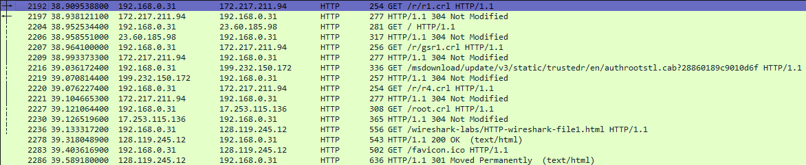

   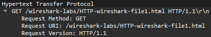

   HTTP 프로토콜: 요청

2. 귀하의 브라우저가 서버에 수용 가능하다고 알린 **언어(languages)**는 무엇입니까?

   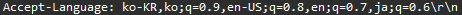

   HTTP 프로토콜: 언어

3. 귀하의 **컴퓨터 IP 주소**와 **gaia.cs.umass.edu 서버의 IP 주소**는 각각 무엇입니까?

   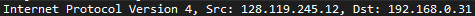

   IP 프로토콜: 송수신 IP주소

4. 서버에서 브라우저로 반환된 **상태 코드(status code)**는 무엇입니까?

   

   HTTP 프로토콜: 응답 304

   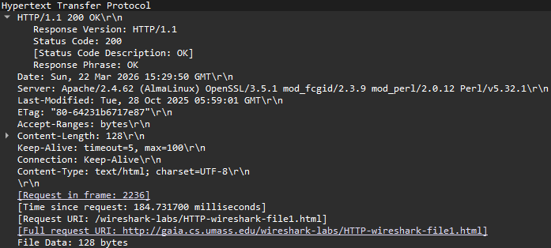

   HTTP 프로토콜: 응답 200

5. 검색 중인 HTML 파일이 서버에서 **마지막으로 수정된 시간(last modified)**은 언제입니까?
   1. `Tue, 28 Oct 2025 05:59:01 GMT\r\n`
6. 브라우저로 반환되는 콘텐츠의 크기는 **몇 바이트**입니까?
   1. 304 상태 코드는 "브라우저가 이미 캐시 파일로 갖고 있으므로, **데이터를 새로 보낼 필요가 없다**"는 것을 의미한다. 따라서 본문의 길이를 나타내는 `Content-Length` 헤더도 나타나지 않는다.
   2. 200 상태 코드를 받은 패킷은 128bytes를 수신하였다.
7. 패킷 콘텐츠 창의 원시 데이터(raw data)를 조사했을 때, 패킷 목록 창에는 표시되지 않은 **헤더**가 있습니까? 있다면 하나만 적어주세요.
   - **`Date`**: 서버가 응답을 보낸 정확한 시간
   - **`Server`**: 서버 소프트웨어의 종류
   - **`Last-Modified`**: 파일이 마지막으로 수정된 날짜
   - **`ETag`**: 캐시 제어를 위한 고유 식별자
   - **`Content-Length`**: 파일의 크기 (128 bytes)
   - **`Content-Type`**: 파일의 형식 (text/html)

위의 5번 질문에 대한 답변에서 (이전 기록된 트레이스 파일을 사용하는 대신 Wireshark를 **"실시간(live)"**으로 실행하고 있다고 가정할 때), 방금 가져온 문서가 다운로드하기 불과 1분 이내에 마지막으로 수정되었다는 사실을 발견하고 놀라셨을 수도 있습니다.

그 이유는 (이 특정 파일의 경우) `gaia.cs.umass.edu` 서버가 해당 파일의 **최종 수정 시간(last-modified time)**을 현재 시간으로 설정하고 있으며, 이를 1분에 한 번씩 수행하고 있기 때문입니다. 따라서 접속 사이에 1분만 기다리면 파일이 최근에 수정된 것처럼 보이게 되고, 결과적으로 브라우저는 해당 문서의 "새로운" 복사본을 다운로드하게 됩니다.

---

## 2. HTTP 조건부 GET(CONDITIONAL GET)/응답 상호작용

교재 2.2.5절에서 배웠듯이, 대부분의 웹 브라우저는 객체 캐싱(object caching)을 수행하며, 따라서 HTTP 객체를 가져올 때 종종 **조건부 GET(conditional GET)**을 실행합니다. 아래 단계를 수행하기 전에 브라우저의 캐시가 비어 있는지 확인하세요.

### 실습 순서

- 웹 브라우저를 실행하고, 위에서 언급한 대로 브라우저 캐시를 삭제했는지 확인합니다.
- Wireshark 패킷 스니퍼를 실행합니다.
- 브라우저에 다음 URL을 입력합니다:
  `http://gaia.cs.umass.edu/wireshark-labs/HTTP-wireshark-file2.html`
  브라우저에 아주 간단한 5줄짜리 HTML 파일이 표시될 것입니다.
- 즉시 동일한 URL을 다시 입력하거나, 브라우저의 **새로고침** 버튼을 누릅니다.
- Wireshark 패킷 캡처를 중단하고, 표시 필터 창에 `http`를 입력하여 HTTP 메시지만 필터링합니다.

실시간 네트워크에서 Wireshark를 실행할 수 없거나 두 번째 GET 요청에서 `If-Modified-Since` 필드가 나타나지 않는 경우, 제공된 패킷 트레이스 파일을 다운로드하여 다음 질문에 답하세요.

### 다음 질문에 답해 보세요

1. 브라우저에서 서버로 보낸 **첫 번째 HTTP GET 요청**의 내용을 조사하세요. 이 GET 메시지에 **"IF-MODIFIED-SINCE"** 줄이 보입니까?
   1. 브라우저가 파일을 처음 요청했기 때문에 이전에 받아둔 파일(캐시)이 없으므로 보이지 않는다

   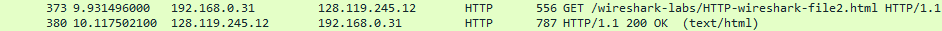

   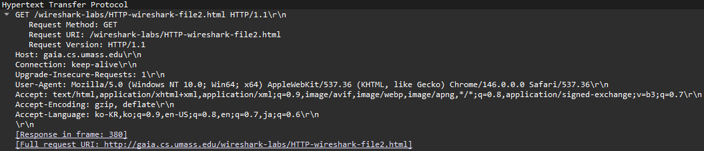

   HTTP 요청

2. 서버 응답 내용을 조사하세요. 서버가 **파일의 내용을 명시적으로 반환**했습니까? 어떻게 알 수 있나요?
   1. 서버가 파일을 명시적으로 반환했다.
   - **`Status Code`**: 200 OK
   - **`File Data`**: 371 bytes

   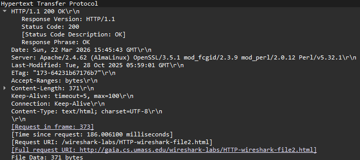

   HTTP 응답

3. 이제 브라우저에서 서버로 보낸 **두 번째 HTTP GET 요청**의 내용을 조사하세요. 이 GET 메시지에는 **"IF-MODIFIED-SINCE:"** 줄이 보입니까? 만약 보인다면, 해당 헤더 뒤에 어떤 정보가 따라옵니까?
   1. 날짜와 시간 정보가 나온다. (예: `Tue, 28 Oct 2025 05:59:01 GMT`)

   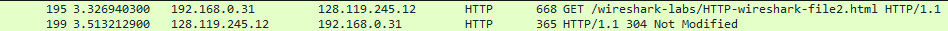

   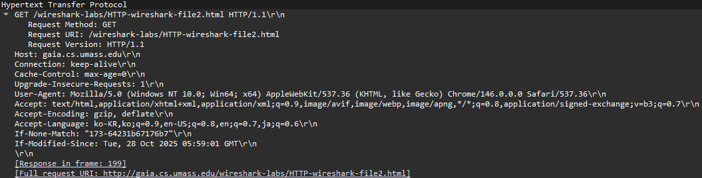

   HTTP 요청2

4. 이 두 번째 HTTP GET에 대해 서버가 반환한 **HTTP 상태 코드(status code)와 문구(phrase)**는 무엇입니까? 서버가 파일의 내용을 명시적으로 반환했습니까? 이유를 설명하세요.
   - **HTTP 상태 코드와 문구:** **`304 Not Modified`**
   - **파일 내용 반환 여부:** 서버가 파일의 내용을 명시적으로 반환하지 않았다.
   - **이유:** 브라우저가 보낸 `If-Modified-Since` 헤더의 날짜와 서버에 있는 파일의 수정 시간을 비교했을 때, 파일이 변경되지 않았기 때문이다. 서버는 파일의 내용이 바뀌지 않았으므로 **304 상태 코드**만 보내고 본문은 비워둔 채 응답한다.

   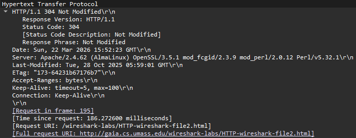

   HTTP 응답2

---

## 3. 긴 문서 검색하기

지금까지의 예제에서는 단순하고 짧은 HTML 파일들만 다루었습니다. 이번에는 긴 HTML 파일을 다운로드할 때 어떤 일이 일어나는지 살펴보겠습니다.

### 실습 순서

- 웹 브라우저를 실행하고, 위에서 설명한 대로 브라우저 캐시가 비워져 있는지 확인합니다.
- Wireshark 패킷 스니퍼를 실행합니다.
- 브라우저에 다음 URL을 입력합니다:
  `http://gaia.cs.umass.edu/wireshark-labs/HTTP-wireshark-file3.html`
  브라우저에 꽤 긴 내용의 '미국 권리장전(US Bill of Rights)'이 표시될 것입니다.
- Wireshark 패킷 캡처를 중단하고, 표시 필터 창에 `http`를 입력하여 HTTP 메시지만 필터링합니다.

패킷 목록 창에서 여러분의 HTTP GET 메시지와 그 뒤를 잇는 **여러 개의 패킷으로 구성된 TCP 응답**을 볼 수 있을 것입니다. 이때, 여러 패킷으로 나누어진 TCP 응답을 모두 확인하려면 Wireshark의 **표시 필터를 해제(clear)**해야 할 수도 있습니다.

이 다중 패킷 응답에 대해 부연 설명을 하자면, 교재 2.2절(그림 2.9)에서 배웠듯이 HTTP 응답 메시지는 상태 라인, 헤더 라인, 빈 줄, 그리고 **엔티티 바디(entity body)**로 구성됩니다. 이번 예제에서 응답의 엔티티 바디는 요청한 HTML 파일 전체입니다. 이 파일은 약 4,500바이트로, 하나의 TCP 패킷에 담기에는 너무 큽니다. 따라서 하나의 HTTP 응답 메시지가 TCP에 의해 여러 조각으로 나뉘고, 각 조각은 별도의 TCP 세그먼트에 담기게 됩니다. 최신 버전의 Wireshark는 각 TCP 세그먼트를 별개의 패킷으로 표시하며, 하나의 HTTP 응답이 여러 TCP 패킷으로 분할되었음을 알리기 위해 Info 열에 **"TCP segment of a reassembled PDU"**라는 문구를 표시합니다.

### 다음 질문에 답해 보세요

1. 브라우저가 보낸 **HTTP GET 요청 메시지**는 총 몇 개입니까? 트레이스에서 '권리장전(Bill of Rights)'에 대한 GET 메시지를 포함하고 있는 패킷 번호는 몇 번입니까?

   ![요청 패킷[77~130], 응답 패킷[131~184]](./images/wireshark-lab-http/image-12.png)

   요청 패킷[77~130], 응답 패킷[131~184]

2. HTTP GET 요청에 대한 응답과 관련된 **상태 코드 및 문구**를 포함하고 있는 패킷 번호는 몇 번입니까?
   - 131번 패킷
3. 응답에 포함된 **상태 코드와 문구**는 무엇입니까?
   - **`HTTP/1.1 200 OK (text/html)`**
4. 단일 HTTP 응답과 권리장전 텍스트를 전달하기 위해 **데이터를 포함한 TCP 세그먼트**가 총 몇 개 필요했습니까?
   - 세그먼트 크기 1460bytes, 3개

   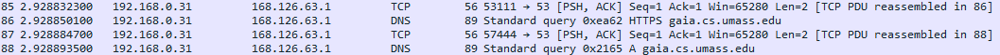

   DNS 쿼리 세그먼트들

   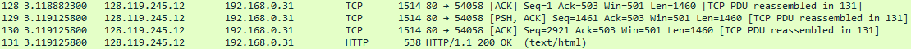

   요청한 본문의 세그먼트들

---

## 4. 객체가 포함된 HTML 문서

이제 Wireshark가 대용량 HTML 파일의 패킷 트래픽을 어떻게 표시하는지 확인했으므로, 브라우저가 **객체가 포함된(embedded objects)** 파일을 다운로드할 때 어떤 일이 일어나는지 살펴보겠습니다. 이는 다른 서버에 저장된 다른 객체(아래 예제의 경우 이미지 파일)를 포함하는 파일을 말합니다.

### 실습 순서

- 웹 브라우저를 실행하고, 위에서 설명한 대로 브라우저 캐시가 비워져 있는지 확인합니다.

- Wireshark 패킷 스니퍼를 실행합니다.
- 브라우저에 다음 URL을 입력합니다:
  `http://gaia.cs.umass.edu/wireshark-labs/HTTP-wireshark-file4.html`
  브라우저에 두 개의 이미지가 포함된 짧은 HTML 파일이 표시될 것입니다. 이 두 이미지는 기본 HTML 파일 내에서 참조됩니다. 즉, 이미지 자체가 HTML에 포함된 것이 아니라, 이미지의 URL이 HTML 파일에 포함되어 있는 것입니다. 교재에서 학습한 대로, 브라우저는 해당 웹사이트들로부터 이 로고들을 가져와야 합니다. 출판사 로고는 `gaia.cs.umass.edu` 웹사이트에서 가져오며, 8판 표지 이미지는 프랑스에 있는 서버에 저장되어 있습니다.
- Wireshark 패킷 캡처를 중단하고, 표시 필터 창에 `http`를 입력하여 캡처된 HTTP 메시지만 표시되도록 합니다.

### 다음 질문에 답해 보세요

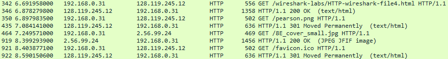

1. 브라우저가 보낸 **HTTP GET 요청 메시지**는 총 몇 개입니까? 이 GET 요청들은 어떤 **인터넷 주소(IP 주소)**로 전송되었습니까?
   - **HTTP GET 요청 메시지:** 3개(`favicon.ico` 제외)
   - **`128.119.245.12`** :HTML 파일 요청, `pearson.png` 파일 요청
   - **`2.56.99.24`** : `8E_cover_small.jpg` 파일 요청
2. 브라우저가 두 개의 이미지를 **순차적(serially)**으로 다운로드했는지, 아니면 두 웹사이트로부터 **병렬(in parallel)**로 다운로드했는지 확인할 수 있습니까? 이유를 설명하세요.
   - 순차적으로 다운로드 되었다.
   - 패킷의 번호와, 송수신한 시간들이 순차적으로 이루어져 있음을 확인할 수 있었다.

---

## 5. HTTP 인증(Authentication)

마지막으로, 비밀번호로 보호된 웹사이트를 방문하여 이러한 사이트에서 교환되는 HTTP 메시지 순서를 살펴보겠습니다. 다음 URL은 비밀번호로 보호되어 있습니다:

`http://gaia.cs.umass.edu/wireshark-labs/protected_pages/HTTP-wireshark-file5.html`

사용자 이름(ID)은 **"wireshark-students"**이고, 비밀번호는 **"network"**입니다. 이 "보안된" 사이트에 접속해 봅시다.

### 실습 순서

- 이전과 마찬가지로 브라우저 캐시를 지우고 브라우저를 종료한 뒤, 다시 실행합니다.
- Wireshark 패킷 스니퍼를 실행합니다.
- 브라우저에 위 URL을 입력합니다.
- 팝업창이 뜨면 사용자 이름과 비밀번호를 입력합니다.
- Wireshark 패킷 캡처를 중단하고, 표시 필터 창에 `http`를 입력하여 HTTP 메시지만 필터링합니다.

이제 Wireshark 출력을 조사해 봅시다. 시작하기 전에 [HTTP 액세스 인증 프레임워크](http://frontier.userland.com/stories/storyReader$2159)에 대한 자료를 읽어보는 것이 도움이 될 것입니다.

---

### 다음 질문에 답해 보세요

1. 브라우저가 보낸 **첫 번째 HTTP GET 메시지**에 대한 서버의 응답(**상태 코드 및 문구**)은 무엇입니까?
   - **서버의 응답 (상태 코드 및 문구):** **`401 Unauthorized`**
   - 인증이 필요한 URL 주소이기 때문에 401 상태 코드를 반환했다.

   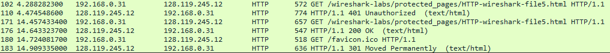

2. 브라우저가 **두 번째로 HTTP GET 메시지**를 보낼 때, 어떤 **새로운 필드**가 포함되어 있습니까?
   - **새로운 필드:** **`Authorization: Basic ...`**

   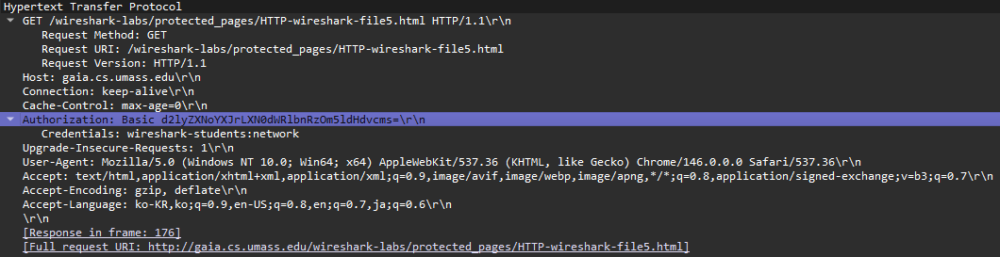

클라이언트의 두 번째 HTTP GET 메시지 내 **"Authorization: Basic"** 헤더 뒤에는 사용자 이름과 비밀번호가 인코딩된 문자열(`d2lyZXNoYXJrLXN0dWRlbnRzOm5ldHdvcms=`)이 포함되어 있습니다.

이 문자열은 암호화된 것처럼 보일 수 있지만, 사실 **Base64**라는 형식으로 단순 인코딩된 것일 뿐 **암호화된 것이 아닙니다!** 이를 확인하려면 [Base64 디코더 사이트](http://www.motobit.com/util/base64-decoder-encoder.asp)에 접속하여 해당 문자열을 넣고 디코딩해 보세요. 짜잔! Base64에서 ASCII로 변환되어 여러분의 아이디와 비밀번호가 그대로 나타나는 것을 볼 수 있습니다.

Wireshark 같은 도구만 있으면 누구나 네트워크를 지나가는 패킷을 훔쳐볼 수 있고, 누구나 Base64를 원래 텍스트로 되돌릴 수 있기 때문에, 추가적인 조치가 없는 단순한 웹사이트 비밀번호는 결코 안전하지 않다는 점을 명심해야 합니다.

걱정하지 마세요! 교재 8장에서 배우겠지만 웹 접속을 더 안전하게 만드는 방법들이 있습니다. 다만, 기본적인 HTTP 인증 프레임워크 이상의 무언가가 확실히 필요하다는 점은 분명해 보이죠?
